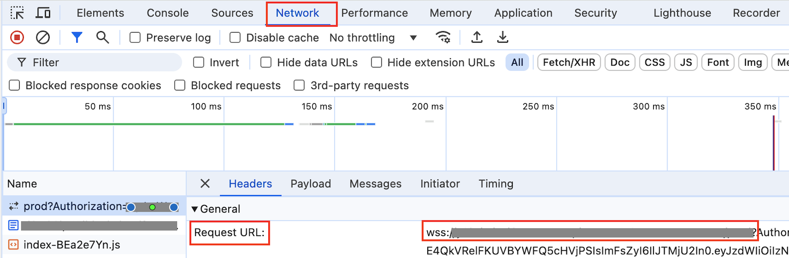

# PowerPoint (ppt) document generation from knowledgebase using Generative AI Application Builder on AWS

This sample code explains how to create a powerpoint (ppt) document from Bedrock/Kendra Knowledgebase based on a predefined powerpoint template for the "Generative AI Application Builder on AWS" solution. https://aws.amazon.com/solutions/implementations/generative-ai-application-builder-on-aws/

Note: This is not a production ready code base, but should rather be used for testing and proof of concepts.

### Bi Sheng

Bi Sheng was an inventor during Song dynasty China. He invented the world's first movable type printing press. Movable
type printing presses use pre-set tiles to form characters, words, sentences, and pages of text. In the same way,
Bisheng enables users to take pre-set language model prompts to form textual responses for standard text artifacts. If
used correctly, Bisheng can take a standard document like a PowerPoint template and generate contextually relevant and
situationally specific copies.

## Table of Contents

1. [Prerequisites](#-prerequisites)
2. [Installation](#-installation)
3. [Getting Started](#-getting-started)
4. [Getting GAAB websocket url](#-getting-gaab-websocket-endpoint-url)
5. [Getting Cognito App ClientID](#getting-cognito-app-clientid) 
6. [Prompting](#-prompting)
   - [System Prompts](#system-prompts)
   - [Generate Prompts](#generate-prompts)
   - [Shots](#shots)
   - [Context](#context)
7. [Configuration](#configuration)
   - [Engines](#engine)
   - [Encoders](#encoders)
   - [Decoders](#decoders)

## ✨ Prerequisites

- Python 3.11+
- AWS Account with Amazon Bedrock Access
- A PowerPoint that you own and can edit
  - Must not contain PII, PHI, or any other sensitive data
- A structurally identical copy of the previous PowerPoint
  - Text can change, but text boxes, slides, and objects must not be modified
  - Must not contain PII, PHI, or any other sensitive data
- A TXT file containing context about the topic which you are printing
  - Must not contain PII, PHI, or any other sensitive data

**Note: Assuming you have [Generative AI Application Builder deployment dashboard and Text use case UI](https://aws.amazon.com/solutions/implementations/generative-ai-application-builder-on-aws/) deployed**

## ✨ Installation

**Step 1**: Clone the repository and navigate to the repo main directory.

**Step 2**: Create a virtual env `python -m venv .` or for Python3 `virtualenv -p python3 venv`

**Step 3**: Activate the virtual env `source venv/bin/activate`

**Step 4**: Install dependencies `pip install -r requirements.txt`

**Step 5**: Install bisheng with `pip install -e .`

## ✨ Getting Started

You can generate PowerPoint documents in 2 ways. 

1. Using [Generative AI Application Builder on AWS](https://aws.amazon.com/solutions/implementations/generative-ai-application-builder-on-aws/) Solution (OR)
2. Using [Amazon Bedrock](https://docs.aws.amazon.com/bedrock/latest/userguide/what-is-bedrock.html). 

### 1. Using [Generative AI Application Builder on AWS](https://aws.amazon.com/solutions/implementations/generative-ai-application-builder-on-aws/) Solution

**Step 1**: Place the powerpoint document in `./demo/gaab` folder as `Prompts.pptx`, `Shots.pptx`, `Output.pptx`

**Step 2**: In `Prompts.pptx` file, add the prompts and format in `<Generate>` `</Generate>` and `<format>` `</format>` tags.

**Step 3**: Go to ./demo/gaab folder and update the `bisheng.yaml` config file with aws_profile, aws_region, [Cognito App ClientID](../README.md#-get-gaab-websocket-endpoint-url)  and [websocket endpoint url](../README.md#-get-gaab-websocket-endpoint-url)  fields with relevant configuration information.

**Step 4**: Run `bisheng run --config-dir ./demo/gaab` and the Output content will be populated in ./demo/gaab/Output.pptx file.

## ✨ Getting Cognito App Client ID

1. Go to Text Use Case CloudFormation stack deployment from [Generative AI Application Builder solution](https://aws.amazon.com/solutions/implementations/generative-ai-application-builder-on-aws/)

2. Go to Resources tab and then search for Cognito, then get the value of `WebsocketRequestProcessorUseCaseCognitoSetupCfnAppClientXXXXXXXX`

## ✨ Getting GAAB websocket endpoint url

1. Open the GAAB Text Use Case UI.

2. Open Developer Tools:

   - In Chrome or Edge: Press F12 or right-click and select "Inspect"
   - In Firefox: Press F12 or right-click and select "Inspect Element"
   - In Safari: Enable developer tools in preferences, then right-click and choose "Inspect Element"

3. Go to the Network tab in the developer tools

4. In the Network tab:

   - Look for a filter or search box
   - Type "WS" or "WebSocket" to filter for WebSocket connections

5. Refresh the page if necessary

6. Look for entries in the Network tab that start with "ws://" or "wss://"

7. Click on the WebSocket connection to see more details, including the full URL

   

### 2. Using [Amazon Bedrock](https://docs.aws.amazon.com/bedrock/latest/userguide/what-is-bedrock.html)

**Step 1**: Place the powerpoint document in `./demo/bedrock` folder as `Prompts.pptx`, `Shots.pptx`, `Output.pptx`

**Step 2**: In `Prompts.pptx` file, add the prompts and format in `<Generate>` `</Generate>` and `<format>` `</format>` tags.

**Step 3**: Go to ./demo/bedrock folder and update the `bisheng.yaml` config file with aws_profile, aws_region, bedrock endpoint url fields with relevant configuration information.

**Step 4**: Run `bisheng run --config-dir ./demo/bedrock` and the Output content will be populated in ./demo/bedrock/Output.pptx file.

## ✨ Prompting

By default, Bisheng offers a single-shot prompt template that assumes unstructured context is applied to contextualize
the request. There are two kinds of prompts supported by bisheng, System prompts and Generate prompts.

### System Prompts

System prompts are stored in the speaker notes for each slide. They are characterized by the &lt;SYSTEM&gt; tag, and behave as
system prompts to a large language model. System prompts are specific to each slide, therefore each slide gets its own
role, motivation, voice, etc. Here is an example system prompt:

> &lt;SYSTEM&gt;You are a solutions architect your primary task is to develop marketing material in the form of customer
> references. Your primary job is to take the text you read and re-word it, summarize it, and generally modify it to
> address particular business outcomes. In the absence of concrete business outcomes, adhere to a default tone and
> diction fitting a business-professional context. Keep responses simple and unstructured, avoiding common templates like
> e-mail or instant message. Where possible, lean on the output format specified in the prompt. Absent this, keep
> responses short, not to exceed the word count in the instruction. It is perfectly acceptable to respond with the
> unaltered prompt where appropriate. Put your explanation within the &lt;rationale/&gt; XML tags. Put your response in
> the &lt;response/&gt; XML tags. You can expect prompts to have the following elements: INPUT DATA, CONTEXT, and OUTPUT
> FORMAT. The input data is what you're being asked to do. The context is background information on the customer or
> scenario you're performing this task for; the context contains many important pieces of information for contextualizing
> your responses. The output format describes how the output should be formatted.&lt;/SYSTEM&gt;

### Generate Prompts

Generate prompts are the actual requests made to an LLM for content generation. Generate prompts are placed within the
text fields of your Prompts PPT. Generate prompts are characterized by &lt;GENERATE&gt; XML tags. The content between
the tags represents what is to be generated. Optionally, a &lt;FORMAT&gt; tag can be introduced, which is meant to help
format the model's response to suit the presentation style. Here is an example generate prompt:

> &lt;GENERATE&gt;Describe the solution implemented by the customer at a high level for marketing purposes. Be sure to
> mention to effectiveness of the solution.&lt;/GENERATE&gt; &lt;FORMAT&gt;Clean, succinct, no more than 3 sentences.
> Keep word count below 75 words.&lt;/FORMAT&gt;

### Shots

Shots come from the PowerPoint file listed in the config under decoder > shots_path. Shots must be structurally
identical to the prompts PowerPoint (decoder > prompts_path). Since the structure of these two PowerPoints are the same,
we can take the GENERATE prompt from the prompts PPTX and match it to the corresponding text in the shots PPTX. If the
structure of these two PowerPoints does not match up, shots from one prompt will be incorrectly applied to a different
prompt. Here is an example "shot" for the previously shown GENERATE prompt:

> Sample Customer developed a robust methodology to generating and evaluating potential therapeutic candidates for
> COVID-19. Utilizing AWS generative AI and compute services and proprietary datasets, models, and evaluation techniques,
> they produced approximately 1,000 potential nanobody candidates specifically targeting a single COVID-19 antigen. The
> rapid development of 1,000 candidate drug formulations enabled Sample Customer to accelerate their drug development
> lifecyle.

### Context

Shots come from the PowerPoint file listed in the config under decoder > context_path. The context is unstructured text.
This text is passed to each prompt by default to contextualize the request with information specific to this printing
job. The context is what grounds

> Sample Customer wants to create more complex proteins like nanobodies and antibodies to help with drug discovery.
> Generating valid nanobody candidates with the right characteristics is a complex, expensive, specialized and
> time-consuming task. Generative AI creates an opportunity to apply human-reasoning to drug discovery tasks at scale,
> fundamentally modifying the approach to drug discovery.
>
> Sample Customer developed a robust methodology to generating and evaluating potential therapeutic candidates for COVID-19.
> Utilizing AWS generative AI and compute services and proprietary datasets, models, and evaluation techniques, they
> produced approximately 1,000 potential nanobody candidates specifically targeting a single COVID-19 antigen. The rapid
> development of 1,000 candidate drug formulations enabled Sample Customer to accelerate their drug development lifecyle.
>
> Sample Customer developed a generative AI powered methodology that generated around 1,000 valid nanobody candidates
> for a single COVID-19 antigen. These results exceeded the project goal of 80% accuracy within the accelerated delivery
> timeline.
>
> The primary challenge was ensuring generated text remained coherent and relevant to the input prompt. To overcome this,
> Sample Customer leveraged a context-aware, memory-enabled language model that considered the entire conversation history
> and user inputs. Additionally, Sample Customer fine-tuned the language model on domain-specific data to improve its
> understanding of the subject matter.
>
> The project spanned 6 weeks, with the initial 2 weeks focused on data preparation and model development. The remainder
> of the engagement included the implementation of custom tokenization strategies, an evaluation framework, and the
> deployment of a language model for antigen identification.

## Configuration

There are three components to the Bisheng configuration file. The Engine defines the generative AI component servicing
each prompt. The Encoders define how prompt responses are written out for consumption. The Decoders convert business
artifacts into prompts for LLMs.

### Engine

Currently, there are two engine types supported: `bedrock` and `gaab`. The `bedrock` engine prompts Bedrock directly.
The `gaab` engine prompts Bedrock through an instance of the AWS Generative AI Application Builder. Each engine type has
their own configuration requirements.

### Encoders

There are two types of encoder: `transparency-report` and `pptx`. The `transparency-report` is required, and it writes
all prompts and responses to a JSON file in the specific location. This is done by default and the application should
not work if the `transparency-report` is missing from the config. The `pptx` encoder encodes model responses to a
specified output PowerPoint.

### Decoders

Currently, only one type of decoder is supported: `one-shot-pptx-with-context`. This decoder simply decodes from a
PowerPoint file. This section is under constructed and is likely to change in the near-term.

### Contributors

**Dan Ferguson**\
**Sreedevi Velagala**

[//]: # "## 📚 Documentation"
[//]: # "## 👏 Contributors"
[//]: # '<a href="https://gitlab.aws.dev/frgud/bisheng/graphs/contributors">'
[//]: # '  '
[//]: # "</a>"

## Security

See [CONTRIBUTING](CONTRIBUTING.md#security-issue-notifications) for more information.

## License

This library is licensed under the MIT-0 License. See the LICENSE file.

